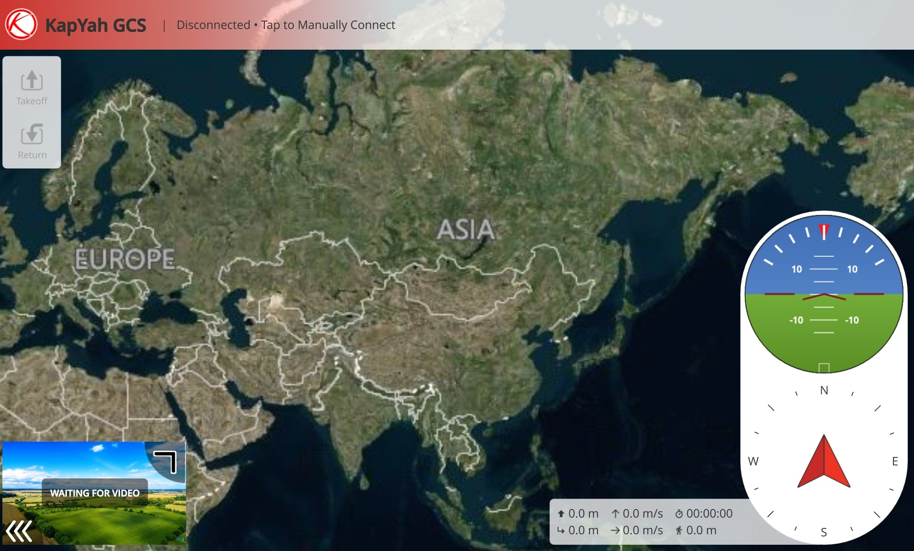
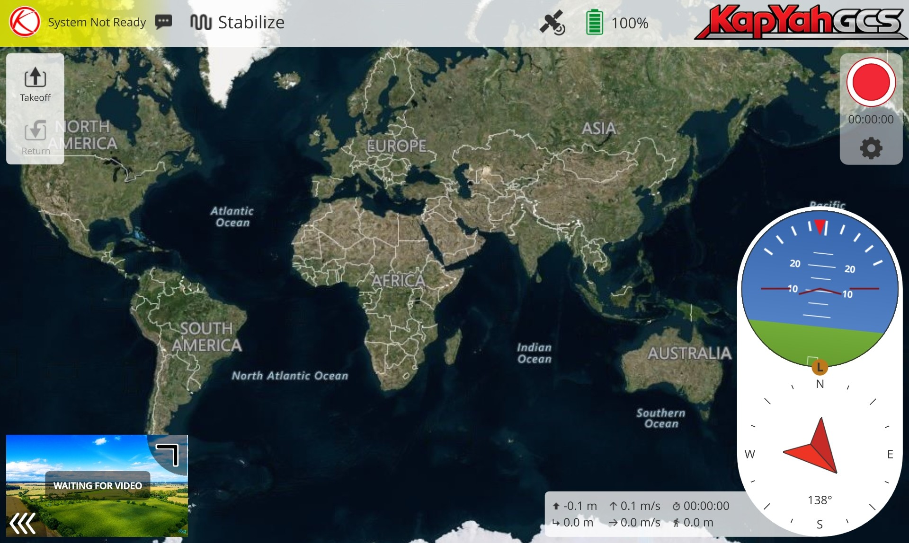
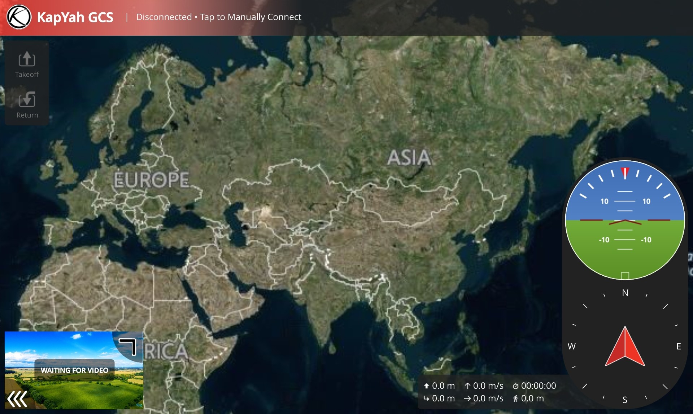
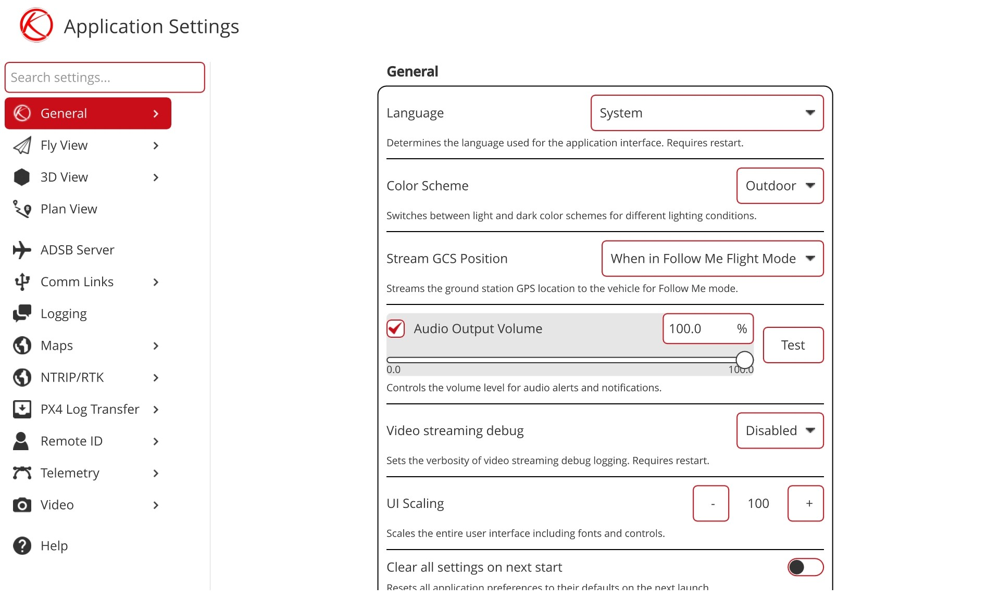
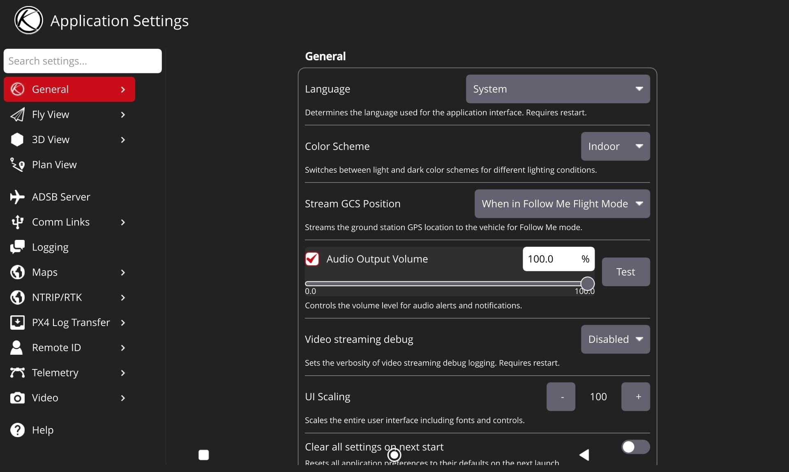

  

---

# KapYah Ground Control (KapYah GCS)

KapYah Ground Control is a Ground Control Station application developed for **KapYah Industries Pvt. Ltd.** It is designed to provide a stable, efficient, and streamlined interface for UAV control, mission management, and operational workflows on Android devices.

This software is part of the KapYah product ecosystem and is intended to support real-world flight operations, configuration, monitoring, and diagnostics for MAVLink-enabled systems.

---

## Download

- [View Latest Release](https://github.com/bldxspark/KapYahGCS-Android/releases)  
- APK: `KapYah-GCS-v1.0.0.apk`

### Android Installation Note

When installing the APK manually, Android may show a warning such as *"App not installed"* or block installation.

This can occur due to:
- unsigned or newly signed APKs  
- restricted install permissions  
- Play Protect warnings  

If you trust the source:
- enable **Install from unknown sources**  
- allow installation via USB (if using ADB)  
- proceed with installation when prompted  

---

## Company

- Company: **KapYah Industries Pvt. Ltd.**  
- Website: https://www.kapyah.com/  
- Product: **KapYah Ground Control**

---

## Developed By

- **Durgesh Tiwari**  
- Embedded Software Engineer  
- KapYah Industries Pvt. Ltd.  
- GitHub: https://github.com/bldxspark  
- LinkedIn: https://www.linkedin.com/in/durgesh-tiwari-9bab82238  
- Email: durgeshtiwari000x@gmail.com  

---

## Product Overview

KapYah Ground Control provides:

- UAV communication and control interface  
- mission planning and execution workflows  
- system status monitoring and telemetry visualization  
- Android-optimized UI for mobile and tablet devices  
- integrated logging and diagnostics support  

---

## Screenshots

### Home Screen

  

### Home (Connected State)

  

### Home (Dark Mode)

  

### Settings Screen

  

### Settings (Dark Mode)

  

## Core Features

- KapYah-branded Ground Control Station interface  
- stable MAVLink communication support  
- responsive layouts for phone and tablet  
- integrated logging system with dedicated storage directory  
- configurable settings panel using structured configuration  
- customized UI components for streamlined workflows  

---

## Logging System

KapYah GCS includes a structured logging system:

- logs stored in a dedicated KapYah GCS directory  
- log save path visible in application settings  
- integrated file dialog for selecting save location  
- designed for debugging, diagnostics, and field operations  

---

## Platform Support

- Android (primary deployment platform)  
- Minimum supported version: Android 9 / API 28  
- optimized for:
  - mobile devices  
  - tablets  

---

## Customization Scope

This project includes multiple enhancements such as:

- application-level branding and UI customization  
- layout fixes and responsiveness improvements  
- settings panel customization using JSON-driven configuration  
- logging system integration and UI exposure  
- Android-specific behavior adjustments  

---

## Ownership

- Product owner: **KapYah Industries Pvt. Ltd.**  
- Product identity and branding: **KapYah Industries Pvt. Ltd.**  
- Primary developer: **Durgesh Tiwari**

---

## Repository Hygiene

This repository excludes:

- build outputs  
- APK files  
- keystore files  
- temporary logs and generated artifacts

The Android release keystore is intentionally excluded. Keep it backed up securely; it is required to publish updates to the installed application.

Only source, configuration, and required assets are maintained.

---

## Contact

- Company website: https://www.kapyah.com/  
- Company email: contact@kapyah.com  
- Developer email: durgeshtiwari000x@gmail.com  

---

## License

This project is dual-licensed under:

- [Apache License 2.0](LICENSE_APACHE)  
- [GNU General Public License v3.0](LICENSE_GPL)  

This project includes components derived from the open-source QGroundControl project.

---

## Acknowledgment

This project builds upon the open-source QGroundControl platform and follows its development and licensing guidelines.
